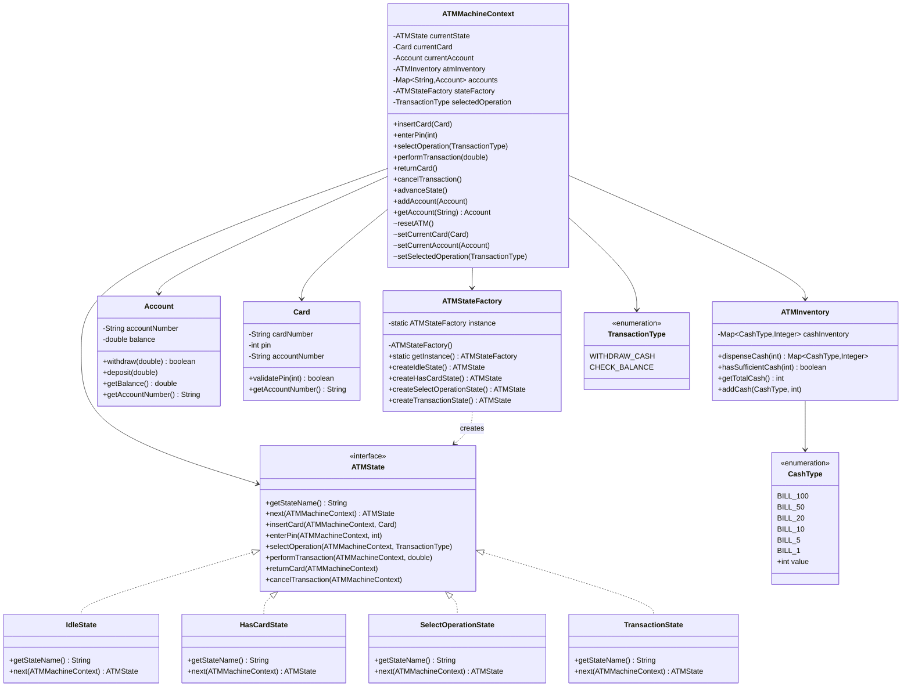

# ATM System

## Table of Contents
1. [Overview](#overview)
2. [Architecture](#architecture)
3. [Class Descriptions](#class-descriptions)
4. [UML Diagrams](#uml-diagrams)

## Overview

This is a fully functional ATM (Automated Teller Machine) system implementation in Java that demonstrates the **State Design Pattern** combined with the **Singleton Pattern**. The system simulates real-world ATM operations including card insertion, PIN validation, transaction selection, and cash dispensing.

### Key Features
- Card insertion and validation
- PIN authentication
- Cash withdrawal with denomination breakdown
- Balance inquiry
- Intelligent cash dispensing algorithm
- State-based transaction flow
- Account management
- ATM inventory management

## Architecture

### Component Overview

```
ATMMachineContext (Context)
    ├── Manages current state
    ├── Handles state transitions
    ├── Processes user actions
    ├── Contains ATMInventory
    └── Manages Accounts and Cards

ATMState (Interface)
    ├── IdleState
    ├── HasCardState
    ├── SelectOperationState
    └── TransactionState

Supporting Components
    ├── Account (Account management)
    ├── Card (Card details & validation)
    ├── ATMInventory (Cash management)
    ├── CashType (Denomination enum)
    └── TransactionType (Operation enum)
```

## Class Descriptions

### ATMMachineContext
**Purpose:** The main context class that maintains the ATM's state and delegates operations to the current state, following the Open/Closed Principle.

**Key Responsibilities:**
- State management and transitions
- Delegates all operations to the current state
- Provides access to ATM resources (inventory, accounts)
- Manages state transitions through `advanceState()`
- Maintains ATM context (current card, account, selected operation)

**Important Methods:**
- `insertCard(Card)`: Delegates to current state
- `enterPin(int)`: Delegates to current state
- `selectOperation(TransactionType)`: Delegates to current state
- `performTransaction(double)`: Delegates to current state
- `returnCard()`: Delegates to current state
- `cancelTransaction()`: Delegates to current state
- `advanceState()`: Transitions to next state
- `resetATM()`: Resets ATM to idle state (package-private, used by states)

### ATMState Interface
**Purpose:** Defines the contract for all state implementations. Each state handles all ATM operations, following the Open/Closed Principle.

**Methods:**
- `getStateName()`: Returns the state name
- `next(ATMMachineContext)`: Determines next state based on context
- `insertCard(ATMMachineContext, Card)`: Handles card insertion in this state
- `enterPin(ATMMachineContext, int)`: Handles PIN entry in this state
- `selectOperation(ATMMachineContext, TransactionType)`: Handles operation selection in this state
- `performTransaction(ATMMachineContext, double)`: Handles transaction execution in this state
- `returnCard(ATMMachineContext)`: Handles card return in this state
- `cancelTransaction(ATMMachineContext)`: Handles transaction cancellation in this state

### State Implementations

#### IdleState
- **Entry Point:** ATM is ready and waiting
- **Actions Allowed:** Insert card
- **Next State:** HasCardState (when card inserted)

#### HasCardState
- **Entry Point:** Card has been inserted
- **Actions Allowed:** Enter PIN, return card
- **Next State:** SelectOperationState (on successful PIN)

#### SelectOperationState
- **Entry Point:** User authenticated successfully
- **Actions Allowed:** Select transaction type, return card
- **Next State:** TransactionState (when operation selected)

#### TransactionState
- **Entry Point:** Transaction type selected
- **Actions Allowed:** Perform transaction, cancel
- **Next State:** SelectOperationState (for another transaction)

### Account
**Purpose:** Represents a bank account linked to a card.

**Attributes:**
- `accountNumber`: Unique identifier
- `balance`: Current account balance

**Methods:**
- `withdraw(double)`: Deducts amount if sufficient balance
- `deposit(double)`: Adds amount to balance
- `getBalance()`: Returns current balance

### Card
**Purpose:** Represents an ATM card with authentication details.

**Attributes:**
- `cardNumber`: Card identifier
- `pin`: Secure PIN (in production, would be hashed)
- `accountNumber`: Linked account

**Methods:**
- `validatePin(int)`: Checks if entered PIN matches
- `getAccountNumber()`: Returns linked account number

### ATMInventory
**Purpose:** Manages cash denominations available in the ATM.

**Key Features:**
- Tracks cash by denomination
- Implements greedy algorithm for cash dispensing
- Ensures exact amount can be dispensed
- Rollback mechanism on failure

**Methods:**
- `dispenseCash(int)`: Returns optimal denomination breakdown
- `hasSufficientCash(int)`: Checks if ATM has enough cash
- `getTotalCash()`: Calculates total cash available
- `addCash(CashType, int)`: Replenishes ATM inventory

**Initial Inventory:**
- $100 bills: 10 ($1,000)
- $50 bills: 10 ($500)
- $20 bills: 20 ($400)
- $10 bills: 30 ($300)
- $5 bills: 20 ($100)
- $1 bills: 50 ($50)
- **Total: $2,350**

### CashType Enum
Defines available cash denominations:
- BILL_100, BILL_50, BILL_20, BILL_10, BILL_5, BILL_1

### TransactionType Enum
Defines available transaction types:
- WITHDRAW_CASH
- CHECK_BALANCE

## UML Diagrams

### Class Diagram


