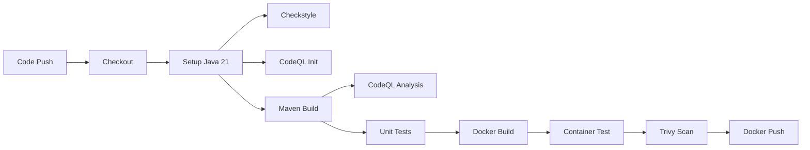
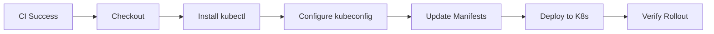

# ATM System - CI/CD Pipeline

[](https://github.com/YOUR_USERNAME/ATM_LLD/actions/workflows/ci.yml)
[](https://github.com/YOUR_USERNAME/ATM_LLD/actions/workflows/cd.yml)
[](https://hub.docker.com/r/YOUR_USERNAME/atm-system)

A production-ready ATM system with complete CI/CD pipeline featuring automated testing, security scanning, Docker containerization, and Kubernetes deployment.

## 📋 Table of Contents

- [Quick Start](#quick-start)
- [Prerequisites](#prerequisites)
- [Repository Setup](#repository-setup)
- [Secrets Configuration](#secrets-configuration)
- [CI Pipeline Explanation](#ci-pipeline-explanation)
- [CD Pipeline Explanation](#cd-pipeline-explanation)
- [Running Locally](#running-locally)
- [Troubleshooting](#troubleshooting)

---

## 🚀 Quick Start

### 1. Fork/Clone Repository

```bash
git clone https://github.com/YOUR_USERNAME/ATM_LLD.git
cd ATM_LLD
```

### 2. Configure Secrets (See [Secrets Configuration](#secrets-configuration))

### 3. Push to Trigger Pipeline

```bash
git add .
git commit -m "Initial commit"
git push origin main
```

### 4. Monitor Pipeline

Go to **Actions** tab in GitHub to see the pipeline running.

---

## 📦 Prerequisites

### Required Accounts

1. **GitHub Account** - For repository and Actions
2. **Docker Hub Account** - For container registry
3. **Kubernetes Cluster** - For deployment (Minikube, GKE, EKS, or AKS)

### Local Development Tools

- **Java 21** - [Download](https://adoptium.net/)
- **Maven 3.9+** - [Download](https://maven.apache.org/download.cgi)
- **Docker** - [Download](https://www.docker.com/get-started)
- **kubectl** - [Install](https://kubernetes.io/docs/tasks/tools/)
- **Git** - [Download](https://git-scm.com/downloads)

---

## 🔧 Repository Setup

### Step 1: Create GitHub Repository

1. Go to [GitHub](https://github.com)
2. Click **New Repository**
3. Name it `ATM_LLD`
4. Choose **Public** or **Private**
5. Click **Create repository**

### Step 2: Push Code

```bash
# Initialize git (if not already done)
git init

# Add remote
git remote add origin https://github.com/YOUR_USERNAME/ATM_LLD.git

# Add all files
git add .

# Commit
git commit -m "Initial commit with CI/CD pipeline"

# Push to main branch
git push -u origin main
```

### Step 3: Enable GitHub Actions

1. Go to repository **Settings**
2. Click **Actions** → **General**
3. Under **Actions permissions**, select **Allow all actions**
4. Click **Save**

---

## 🔐 Secrets Configuration

GitHub Secrets store sensitive information securely. Configure these before running the pipeline.

### Required Secrets

| Secret Name | Description | How to Get |
|-------------|-------------|------------|
| `DOCKERHUB_USERNAME` | Docker Hub username | Your Docker Hub username |
| `DOCKERHUB_TOKEN` | Docker Hub access token | [Create token](https://hub.docker.com/settings/security) |
| `KUBECONFIG` | Kubernetes config (base64) | See below |

### Step-by-Step Secret Configuration

#### 1. Docker Hub Secrets

**Get Docker Hub Username**:
- Your Docker Hub username (e.g., `johndoe`)

**Create Docker Hub Access Token**:
1. Log in to [Docker Hub](https://hub.docker.com)
2. Go to **Account Settings** → **Security**
3. Click **New Access Token**
4. Name: `github-actions`
5. Permissions: **Read, Write, Delete**
6. Click **Generate**
7. **Copy the token** (you won't see it again!)

**Add to GitHub**:
1. Go to repository **Settings** → **Secrets and variables** → **Actions**
2. Click **New repository secret**
3. Add `DOCKERHUB_USERNAME`:
   - Name: `DOCKERHUB_USERNAME`
   - Value: Your Docker Hub username
4. Click **Add secret**
5. Add `DOCKERHUB_TOKEN`:
   - Name: `DOCKERHUB_TOKEN`
   - Value: Paste the access token
6. Click **Add secret**

#### 2. Kubernetes Config Secret

**Get Kubeconfig**:

```bash
# For Minikube
cat ~/.kube/config | base64

# For cloud providers (GKE, EKS, AKS)
# Make sure you're connected to your cluster first
kubectl config view --raw | base64
```

**Add to GitHub**:
1. Go to repository **Settings** → **Secrets and variables** → **Actions**
2. Click **New repository secret**
3. Name: `KUBECONFIG`
4. Value: Paste the base64-encoded kubeconfig
5. Click **Add secret**

### Verify Secrets

After adding secrets, you should see:

```
✅ DOCKERHUB_USERNAME
✅ DOCKERHUB_TOKEN
✅ KUBECONFIG
```

---

## 🔄 CI Pipeline Explanation

The **Continuous Integration (CI)** pipeline runs on every push to `main` branch.

### Pipeline File: `.github/workflows/ci.yml`

### Pipeline Stages



### Stage 1: Code Quality & Security

#### **Checkstyle Analysis**
```yaml
- name: Run Maven Checkstyle
  run: mvn checkstyle:check
  continue-on-error: true
```

**Purpose**: Enforce coding standards  
**Checks**: Code formatting, naming conventions, complexity  
**Action**: Warns on violations (doesn't fail build)

#### **CodeQL Security Scan**
```yaml
- name: Initialise CodeQL
  uses: github/codeql-action/init@v4
  with:
    languages: java
```

**Purpose**: Detect security vulnerabilities  
**Scans For**:
- SQL injection
- Cross-site scripting (XSS)
- Code injection
- Path traversal
- Hard-coded credentials

**Action**: Fails build on critical vulnerabilities

### Stage 2: Build & Test

#### **Maven Build**
```yaml
- name: Build with Maven
  run: mvn clean package --file pom.xml
```

**Purpose**: Compile code and create JAR  
**Output**: `target/atm-1.0-SNAPSHOT.jar`  
**Includes**: All dependencies bundled (Maven Shade plugin)

#### **Unit Tests**
```yaml
- name: Run Unit Tests
  run: mvn test
```

**Purpose**: Verify code functionality  
**Tests**: 113 unit tests  
**Coverage**: 88%+  
**Action**: Fails build if any test fails

**Test Categories**:
- ✅ Domain tests (Account, Card, Inventory)
- ✅ State machine tests (4 states)
- ✅ Integration tests (end-to-end workflows)

### Stage 3: Containerization

#### **Docker Build**
```yaml
- name: Build Docker Image
  run: docker build -t atm-system:latest .
```

**Purpose**: Create container image  
**Strategy**: Multi-stage build  
**Base Images**:
- Build: `maven:3.9.6-eclipse-temurin-21-alpine`
- Runtime: `eclipse-temurin:21-jre-alpine`

**Image Size**: ~200MB (optimized)

**Dockerfile Highlights**:
```dockerfile
# Stage 1: Build
FROM maven:3.9.6-eclipse-temurin-21-alpine AS build
WORKDIR /app
COPY pom.xml .
RUN mvn dependency:go-offline -B
COPY src ./src
RUN mvn clean test package -B

# Stage 2: Runtime
FROM eclipse-temurin:21-jre-alpine AS runtime
WORKDIR /app
COPY --from=build /app/target/atm-1.0-SNAPSHOT.jar app.jar
RUN addgroup -S appgroup && adduser -S appuser -G appgroup
USER appuser
ENTRYPOINT ["sh", "-c", "java $JAVA_OPTS -jar app.jar"]
```

#### **Container Test**
```yaml
- name: Run Container and Test
  run: |
    docker run -d --name atm-container atm-system
    sleep 20
    docker stop atm-container
    docker rm atm-container
```

**Purpose**: Verify container runs successfully  
**Test**: Start container, wait, stop, cleanup  
**Action**: Fails if container crashes

### Stage 4: Security Scanning

#### **Trivy Vulnerability Scan**
```yaml
- name: Trivy image scan
  uses: aquasecurity/trivy-action@master
  with:
    image-ref: atm-system:latest
    scan-type: image
    format: table
```

**Purpose**: Scan for container vulnerabilities  
**Scans**:
- OS package vulnerabilities
- Application dependencies
- Misconfigurations
- Secrets in images

**Severity Levels**: CRITICAL, HIGH, MEDIUM, LOW

### Stage 5: Publish

#### **Docker Hub Push**
```yaml
- name: Login to Docker Hub
  uses: docker/login-action@v3
  with:
    username: ${{ secrets.DOCKERHUB_USERNAME }}
    password: ${{ secrets.DOCKERHUB_TOKEN }}

- name: Tag image for Docker Hub
  run: docker tag atm-system:latest ${{ secrets.DOCKERHUB_USERNAME }}/atm-system:latest

- name: Push Docker image
  run: docker push ${{ secrets.DOCKERHUB_USERNAME }}/atm-system:latest
```

**Purpose**: Publish image to Docker Hub  
**Tag**: `YOUR_USERNAME/atm-system:latest`  
**Visibility**: Public (can be changed to private)

### CI Pipeline Duration

| Stage | Duration |
|-------|----------|
| Checkout & Setup | ~30s |
| Code Quality | ~20s |
| Build & Test | ~2min |
| Docker Build | ~30s |
| Security Scan | ~20s |
| Push | ~30s |
| **Total** | **~4-5 min** |

---

## 🚢 CD Pipeline Explanation

The **Continuous Deployment (CD)** pipeline runs automatically after successful CI completion.

### Pipeline File: `.github/workflows/cd.yml`

### Pipeline Trigger

```yaml
on:
  workflow_run:
    workflows: ["Java CI"]
    types: [completed]
```

**Trigger**: Runs when "Java CI" workflow completes successfully  
**Condition**: Only if CI passed

### Deployment Stages



### Stage 1: Setup

#### **Checkout Code**
```yaml
- uses: actions/checkout@v4
```

**Purpose**: Get latest K8s manifests

#### **Install kubectl**
```yaml
- name: Install kubectl
  uses: azure/setup-kubectl@v4
```

**Purpose**: Install Kubernetes CLI  
**Version**: Latest stable

### Stage 2: Configuration

#### **Configure Kubeconfig**
```yaml
- name: Configure kubeconfig
  run: |
    mkdir -p ~/.kube
    echo "${{ secrets.KUBECONFIG }}" | base64 -d > ~/.kube/config
```

**Purpose**: Authenticate with Kubernetes cluster  
**Method**: Decode base64 kubeconfig from secrets  
**Output**: `~/.kube/config`

### Stage 3: Deployment

#### **Update Manifests**
```yaml
- name: Deploy to Kubernetes
  run: |
    sed -i "s|<DOCKERHUB_USERNAME>|${{ secrets.DOCKERHUB_USERNAME }}|g" k8s/deployment.yaml
    kubectl apply -f k8s/deployment.yaml
```

**Purpose**: Deploy to Kubernetes  
**Steps**:
1. Replace placeholder with actual Docker Hub username
2. Apply deployment manifest

**Kubernetes Manifest** (`k8s/deployment.yaml`):
```yaml
apiVersion: apps/v1
kind: Deployment
metadata:
  name: atm-cli
spec:
  replicas: 1
  selector:
    matchLabels:
      app: atm
  template:
    metadata:
      labels:
        app: atm
    spec:
      containers:
        - name: atm
          image: docker.io/<DOCKERHUB_USERNAME>/atm-system:latest
          stdin: true
          tty: true
```

#### **Verify Rollout**
```yaml
- name: Verify Rollout
  run: kubectl rollout status deployment/atm-cli
```

**Purpose**: Ensure deployment succeeded  
**Checks**: Pod status, readiness  
**Action**: Fails if rollout unsuccessful

### CD Pipeline Duration

| Stage | Duration |
|-------|----------|
| Setup | ~20s |
| Configure | ~10s |
| Deploy | ~30s |
| Verify | ~30s |
| **Total** | **~1-2 min** |

### Deployment Strategy

**Current**: Rolling update (default)  
**Replicas**: 1 (can be scaled)  
**Image Pull Policy**: Always (gets latest image)

---

## 💻 Running Locally

### Option 1: Run with Maven

```bash
# Run tests
mvn clean test

# Build and run
mvn clean package
java -jar target/atm-1.0-SNAPSHOT.jar
```

### Option 2: Run with Docker

```bash
# Build image
docker build -t atm-system:local .

# Run container
docker run --rm atm-system:local

# Run interactively
docker run -it --rm atm-system:local sh
```

### Option 3: Run in Kubernetes (Local)

```bash
# Start Minikube
minikube start

# Build and load image
docker build -t atm-system:local .
minikube image load atm-system:local

# Update deployment to use local image
sed -i 's|docker.io/.*|atm-system:local|' k8s/deployment.yaml

# Deploy
kubectl apply -f k8s/deployment.yaml

# Check status
kubectl get pods
kubectl logs -f deployment/atm-cli

# Cleanup
kubectl delete -f k8s/deployment.yaml
minikube stop
```

---

## 🐛 Troubleshooting

### CI Pipeline Issues

#### **Tests Fail Locally**

**Problem**: Tests pass in Docker but fail locally  
**Cause**: Java version mismatch (local Java 25 vs Docker Java 21)

**Solution**:
```bash
# Option 1: Use Docker for testing
docker build --target build -t atm-test .

# Option 2: Install Java 21 locally
# Using SDKMAN
sdk install java 21.0.1-tem
sdk use java 21.0.1-tem

# Using Homebrew
brew install openjdk@21
```

#### **Docker Build Fails**

**Problem**: "no main manifest attribute"  
**Cause**: Maven Shade plugin not creating executable JAR

**Solution**: Already fixed in `pom.xml` with:
```xml
<plugin>
    <groupId>org.apache.maven.plugins</groupId>
    <artifactId>maven-shade-plugin</artifactId>
    <configuration>
        <transformers>
            <transformer implementation="...ManifestResourceTransformer">
                <mainClass>org.example.Main</mainClass>
            </transformer>
        </transformers>
    </configuration>
</plugin>
```

#### **CodeQL Fails**

**Problem**: CodeQL analysis times out  
**Solution**: Increase timeout in workflow:
```yaml
- name: CodeQL Analysis
  uses: github/codeql-action/analyze@v4
  timeout-minutes: 20
```

### CD Pipeline Issues

#### **Kubeconfig Invalid**

**Problem**: "Unable to connect to cluster"  
**Cause**: Incorrect or expired kubeconfig

**Solution**:
```bash
# Regenerate kubeconfig
kubectl config view --raw | base64

# Update GitHub secret with new value
```

#### **Image Pull Fails**

**Problem**: "ImagePullBackOff"  
**Causes**:
1. Docker Hub credentials incorrect
2. Image doesn't exist
3. Private image without credentials

**Solution**:
```bash
# Verify image exists
docker pull YOUR_USERNAME/atm-system:latest

# Check Docker Hub credentials
docker login

# For private images, create K8s secret
kubectl create secret docker-registry dockerhub-secret \
  --docker-server=docker.io \
  --docker-username=YOUR_USERNAME \
  --docker-password=YOUR_TOKEN

# Update deployment to use secret
# Add to k8s/deployment.yaml:
spec:
  imagePullSecrets:
    - name: dockerhub-secret
```

#### **Deployment Stuck**

**Problem**: Deployment not progressing  
**Solution**:
```bash
# Check pod status
kubectl get pods

# Check pod logs
kubectl logs deployment/atm-cli

# Describe pod for events
kubectl describe pod POD_NAME

# Check deployment events
kubectl describe deployment atm-cli

# Force rollout restart
kubectl rollout restart deployment/atm-cli
```

### Common Errors

| Error | Cause | Solution |
|-------|-------|----------|
| `Tests run: 113, Failures: 44` | Java 25 locally | Use Docker or Java 21 |
| `no main manifest attribute` | Shade plugin issue | Check pom.xml configuration |
| `ImagePullBackOff` | Image not found | Verify Docker Hub push succeeded |
| `CrashLoopBackOff` | Container exits immediately | Check application logs |
| `Unauthorized` | Docker Hub credentials | Verify secrets are correct |

---

## 📊 Monitoring Pipeline

### View Pipeline Status

1. Go to repository on GitHub
2. Click **Actions** tab
3. See all workflow runs

### View Logs

1. Click on a workflow run
2. Click on a job (e.g., "build")
3. Expand steps to see logs

### Download Artifacts

Some workflows upload artifacts (test reports, JARs):
1. Go to workflow run
2. Scroll to **Artifacts** section
3. Click to download

---

## 🔗 Useful Links

- **GitHub Actions Docs**: https://docs.github.com/en/actions
- **Docker Hub**: https://hub.docker.com
- **Kubernetes Docs**: https://kubernetes.io/docs
- **CodeQL**: https://codeql.github.com
- **Trivy**: https://aquasecurity.github.io/trivy

---

## 📝 Additional Documentation

- **[CICD_DOCUMENTATION.md](CICD_DOCUMENTATION.md)** - Complete CI/CD documentation with diagrams and analysis
- **[README.md](README.md)** - Main project README (this file)

---

## 🤝 Contributing

1. Fork the repository
2. Create a feature branch (`git checkout -b feature/amazing-feature`)
3. Commit your changes (`git commit -m 'Add amazing feature'`)
4. Push to the branch (`git push origin feature/amazing-feature`)
5. Open a Pull Request

---

## 📄 License

This project is licensed under the MIT License.

---

## 👤 Author

**Your Name**
- GitHub: [@YOUR_USERNAME](https://github.com/YOUR_USERNAME)
- Docker Hub: [YOUR_USERNAME](https://hub.docker.com/u/YOUR_USERNAME)

---

**Last Updated**: January 2026  
**Pipeline Status**: ✅ Production Ready
